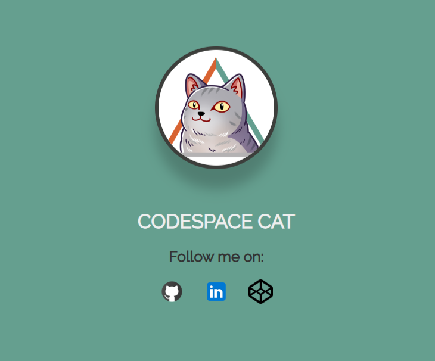

# [SDF03]: Your First GitHub Repo

This project is designed for beginners to get hands-on experience with version control using Git and GitHub. By completing this project, students will learn how to fork a repository, make changes, commit these changes, and push them back to the repository. This practical exercise will also include updating personal information and images in a simple HTML page, providing a basic understanding of web development alongside version control skills.

## Objectives
- Fork the SDF03 GitHub repository.
- Make changes to the HTML file within the repository.
- Commit the changes to the repository.
- Push the changes back to the GitHub repository.
- Submit the updated repository link to the SDF03 Project Tab on Learning Management System (LMS).

## Tasks
1. **Fork the Repository**: Login to GitHub and fork the SDF repository to your local machine. Instructions on how to fork a repository can be found in GitHub's help documentation.

2. **Modify the HTML File**: Open the cloned repository on your local machine in VSCode and navigate to the `index.html` file. You are required to make the following changes:
   - **Name and Surname**: Replace "CodeSpace Cat" with your own name and surname.
   - **Profile Picture**: Replace the existing picture of the CodeSpace Cat with a picture of yourself. Ensure your picture is placed in the `./images/` directory of the repository, and update the `` tag src attribute to reflect the path to your new picture.
   - **Social Links**: Update the href attributes of the `<a>` tags to point to your own GitHub, LinkedIn, and CodePen profiles. Ensure these links are correct and functional.

3. **Commit Your Changes**: After making the necessary changes, save the `index.html` file. Use Git to add and commit these changes to your local repository. Ensure your commit message is clear and descriptive.

4. **Push Changes to GitHub**: Push your committed changes back to the original GitHub repository using Git. This step will require you to have write access to the repository, or you may fork the repository and push your changes to the forked version.

5. **Submit Your Work**: Once your changes are pushed, copy the URL of your GitHub repository. Submit this link through the LMS to complete the project assignment.

## Submission Guidelines
- Submit the GitHub repository URL through the LMS.
- Verify that the link to your repository is accessible and not set to private.

## Resources
- [Git Documentation](https://git-scm.com/doc)
- [GitHub Help](https://help.github.com)

## Support
If you encounter any difficulties while working on this project, please reach out to your coach for assistance. Happy coding!